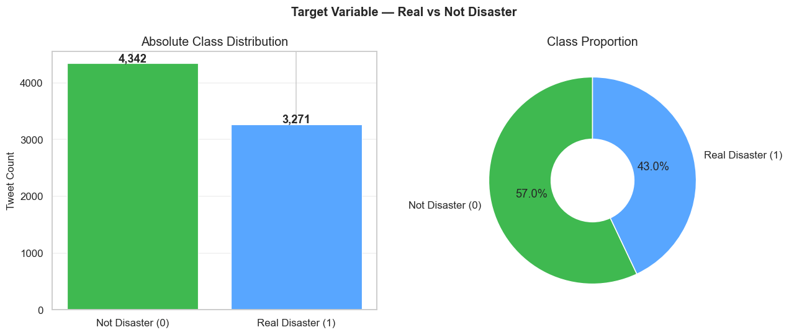
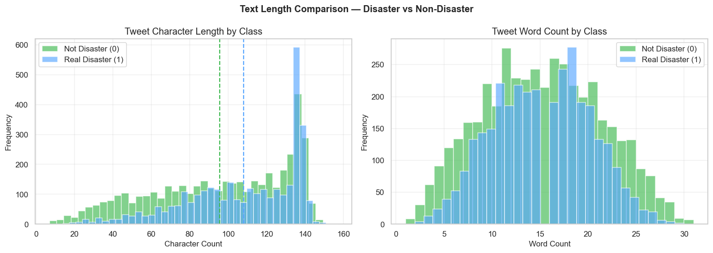
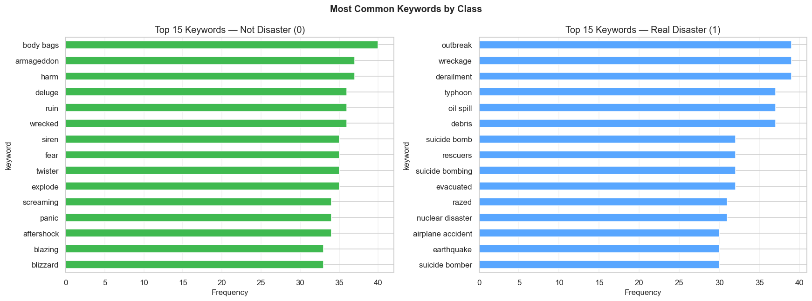
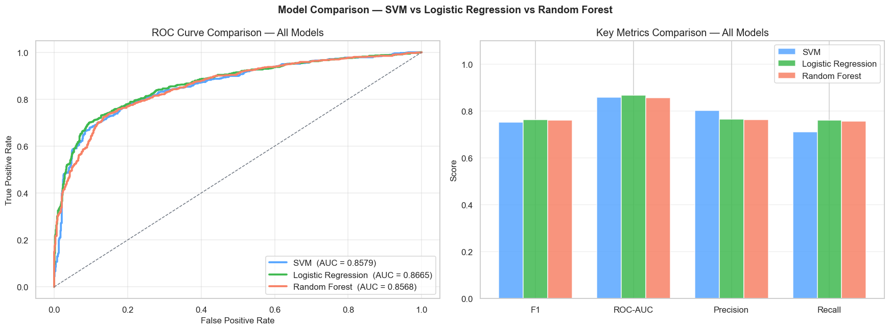

# DisasterAlert

## Real-Time Disaster Tweet Classification using NLP & Machine Learning

**Identifying genuine disaster reports from noisy social media content.**

DisasterAlert classifies tweets as real disaster events or non-disaster posts using advanced NLP preprocessing, TF-IDF vectorization, and supervised machine learning.

---

## Repository Description

DisasterAlert is an end-to-end text classification project that detects whether a tweet refers to an actual crisis or uses disaster-related language figuratively. The project combines:

- text cleaning and normalization,
- TF-IDF-based feature engineering,
- supervised learning with SVM, Logistic Regression, and Random Forest.

This repository is built to support emergency monitoring systems, crisis response teams, journalists, and researchers by filtering meaningful disaster-related signals from social media noise.

---

## Core Features

- **Complete NLP pipeline** for tweet preprocessing, including URL removal, mention handling, punctuation cleaning, tokenization, and lemmatization.
- **TF-IDF feature extraction** with unigram and bigram support.
- **Model comparison** across SVM, Logistic Regression, and Random Forest.
- **Robust evaluation** using cross-validation, precision/recall, F1 score, and ROC-AUC.
- **Exploratory data analysis** with class distributions, text statistics, and keyword insights.

---

## Tech Stack

- Python 3.8+
- Pandas, NumPy
- NLTK
- scikit-learn
- Matplotlib, Seaborn
- Jupyter Notebook
- joblib

---

## Visual Highlights

### Target distribution and tweet composition


### Text length and structural patterns


### Keyword signals for accurate classification


### Model comparison across classifiers


---

## Quick Start

### 1. Clone the repository

```bash
git clone https://github.com/divyanshu478/disaster-alert.git
cd disaster-alert
```

### 2. Set up the environment

```bash
python -m venv venv
venv\Scripts\activate
```

### 3. Install dependencies

```bash
pip install -r requirements.txt
```

### 4. Download NLTK data

```python
import nltk
nltk.download('stopwords')
nltk.download('punkt')
nltk.download('wordnet')
```

### 5. Open the notebook

```bash
jupyter notebook notebooks/nlp_disaster_tweet_classification.ipynb
```

---

## Project Structure

```
disaster-alert/
├── data/
│   └── train.csv
├── notebooks/
│   └── nlp_disaster_tweet_classification.ipynb
├── outputs/
│   └── eda/
├── README.md
├── requirements.txt
└── LICENSE
```

---

## Author

### Divyanshu Kumawat
Aspiring Data Scientist & Machine Learning Engineer.

Focused on building practical AI and ML solutions using:

- Python
- SQL
- Machine Learning
- Deep Learning
- Data Analytics
- Generative AI

### Connect with me

- GitHub: https://github.com/divyanshu478
- Repository: https://github.com/divyanshu478/disaster-alert

---

## If You Like This Project

- Star the repository
- Fork and extend the project
- Open issues for enhancements
- Contribute model improvements or deployment support

---

## GitHub About Description (160 characters)

```
NLP-powered disaster tweet classification using TF-IDF, SVM, Logistic Regression, and Random Forest for real-time emergency signal detection.
```

## GitHub Topics

```
nlp
machine-learning
data-science
text-classification
tweet-classification
disaster-detection
tfidf
scikit-learn
python
nltk
classification
kaggle
```

